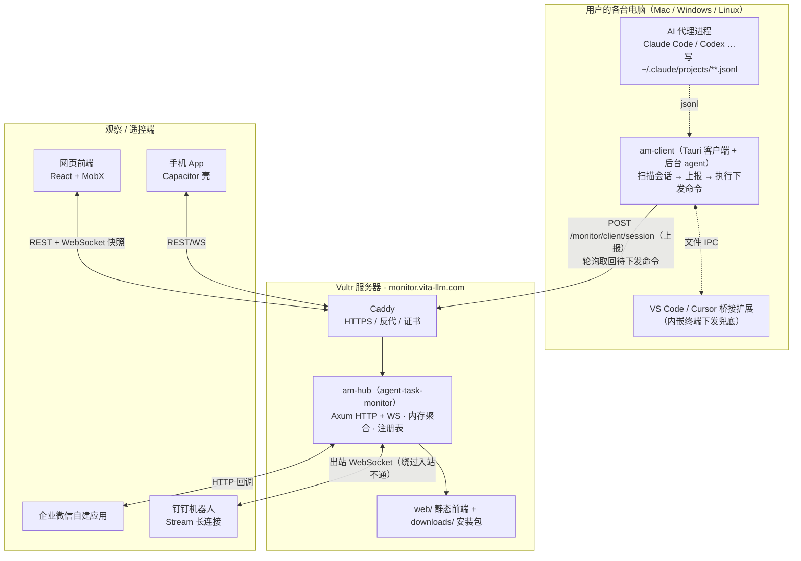
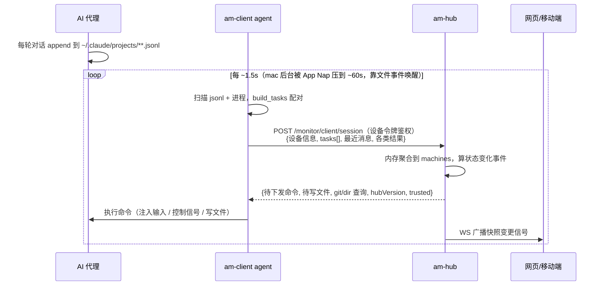
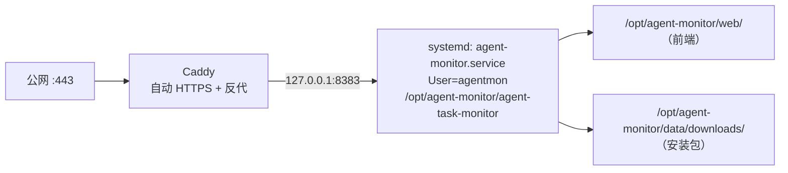

# 终端任务监控 · 整体架构与技术路线

> 版本基线：本文对应仓库 `0.7.70`（hub/桌面客户端），前端 build-id `ms32m6iy`。
> 面向：新接手的开发者、部署运维、以及需要通盘理解系统的人。

---

## 1. 这是什么

**终端任务监控**是一套「多设备终端里 AI 编码代理（Claude Code、Codex、Gemini CLI 等）任务的实时监控 + 远程遥控」系统。

核心能力：

- **实时监控**：本机后台扫描各终端里正在跑的 AI 代理会话，把「谁在跑什么任务、进行到哪一步、要不要人介入」实时同步出来。
- **多端查看**：网页（PC/移动）、桌面客户端、手机 App、钉钉/企业微信机器人，都能看到全部设备的会话。
- **远程遥控**：从任意端向某台设备的某个终端会话下发任务、暂停/中断/终止、回应交互式选择、撤回排队输入、上传文件。
- **协助共享**：把自己设备的会话临时共享给他人远程协助。
- **主动推送**：任务完成 / 需要选择 / 会话结束等，主动推到钉钉私聊。

设计原则：**会话内容纯实时读取、不落存储**（hub 只在内存里缓存最近消息，不持久化会话正文）。

---

## 2. 整体架构



**一句话数据流**：客户端在本机扫描 AI 代理的会话文件 → 加密上报给 hub → hub 内存聚合并经 WebSocket 推送给网页/移动端 → 用户下发的命令进 hub 的待发队列 → 客户端下次上报时取回并在本机终端执行。

---

## 3. 组件构成

### 3.1 Rust 工作区 `agent-task-monitor/`

三个 crate，一套 `Cargo.toml` workspace（版本号统一）：

| Crate | bin 名 | 角色 |
|---|---|---|
| **am-core** (`core/`) | — | 纯逻辑库：会话扫描、进程配对、jsonl 解析、git diff。**无 IO 副作用、可单测**（45 个单测） |
| **am-hub** (`hub/`) | `agent-task-monitor` | 服务端：HTTP/WS API、内存聚合、用户/设备注册表、机器人集成 |
| **am-client** (`client/`) | `agent-monitor` | 桌面客户端：Tauri v2 窗口 + 系统托盘 + 后台上报 agent |

**am-core 模块**
- `scanner.rs` —— 会话扫描核心：读 jsonl、`build_tasks` 把进程配对到会话、解析最近消息、队列回放。**系统最复杂的部分**。
- `process.rs` —— 进程扫描（sysinfo）、`session_pins`（读环境变量做权威配对）、IDE 终端 shell pid 回溯。
- `model.rs` —— 全体共享数据结构（Task / MessageBrief / ControlCmd / FileTransfer …）。
- `gitdiff.rs` —— 会话工作目录的 git 改动概览。

**am-hub 模块**
- `main.rs` / `server.rs` —— 启动 + 全部 HTTP/WS 路由与处理。
- `state.rs` —— `AppState`：机器聚合表 `machines`、登录会话、配对码、钉钉推送去抖状态。
- `registry.rs` —— 用户 + 设备信任 + 机器人配置的持久化注册表（`registry.json`）。
- `crypto.rs` —— 登录口令的 RSA+AES 解密（与前端 `.env` 密钥配对）。
- `oauth.rs` —— 第三方登录（Apple / 钉钉 等）。
- `dingtalk.rs` / `dingtalk_stream.rs` —— 钉钉主动推送 + Stream 长连接双向遥控。
- `bot.rs` —— 渠道无关的机器人指令分发（会话/发/暂停/撤回/监控/@N 速记 …）。
- `wecom.rs` —— 企业微信自建应用。
- `admin.rs` / `commands.rs` —— 后台管理、部署令牌校验。

**am-client 模块**
- `main.rs` / `desktop.rs` —— Tauri 窗口、托盘、自更新、开机自启、保活、桥接扩展自动安装。
- `agent.rs` —— 后台上报循环：扫描 → 上报 → 取回命令 → 执行（注入输入 / 控制 / 写文件 / git 查询）。
- `state.rs` —— 客户端状态、`safe_upload_dir` 上传目录白名单校验。
- `bridge.rs` —— 与 VS Code/Cursor 扩展的文件 IPC 桥。
- `openfiles.rs` —— （诊断用）句柄扫描配对，默认不跑。
- `secrets.rs` —— 设备令牌本地安全存储（mac Keychain / Windows DPAPI）。

### 3.2 前端 `agent-monitor-web/`

React 18 + TypeScript + MobX + webpack 5，组件优先用私有库 `@hsu-react/ui`，antd 兜底。

- `pages/Portal/` —— 主界面（对话式监控 + 遥控），核心组件：`ChatPane`（会话正文）、`TerminalFeed`（终端消息流 + 交互式选择卡）、`Composer`（发布任务 + 文件上传 + slash 命令）、`SessionPanels`（清单/后台任务）、`SettingsModal`（账户/设备/机器人/安全/关于）。
- `pages/{Login,Home,PwdChange,permit,sysmgmt}/` —— 登录、官网、改密、后台管理。
- `stores/` —— MobX，`PortalStore` 是核心（设备/会话/消息/下发/WS）。
- 由 hub 直接 file_server 托管（`web/` 目录），SPA 深链回退 index.html。

### 3.3 其它端

- **手机 App** `mobile-app/` —— Capacitor 壳套同一套前端，产出 Android APK（`android` 版本线）。
- **VS Code/Cursor 扩展** `agent-monitor-vscode/` —— 内嵌终端下发的兜底桥，客户端默认自动安装。
- **桌面安装产物** `clients/` —— mac `.dmg` / Windows `.exe`。

---

## 4. 技术栈总览

| 层 | 技术 |
|---|---|
| 服务端 | Rust · Axum 0.7（HTTP+WS+multipart）· Tokio · tower-http（CORS/fs/header） |
| 加密 | RSA 0.9 + AES-GCM（登录）· HMAC-SHA256（钉钉加签） |
| 实时/长连接 | WebSocket（前端快照推送）· tokio-tungstenite（钉钉 Stream，rustls） |
| 进程/系统 | sysinfo（跨平台进程 + 环境变量）· Windows Console API · ConPTY · caffeinate / SetThreadExecutionState |
| 桌面客户端 | Tauri v2（Rust + WebView）· 系统托盘 · 自更新 |
| 前端 | React 18 · TypeScript · MobX · webpack 5 · scss · @hsu-react/ui |
| 移动端 | Capacitor（Android/iOS 壳） |
| 交叉编译 | cargo-zigbuild（Linux musl）· cargo-xwin（Windows MSVC 目标，mac 上编 win） |
| 部署 | systemd · Caddy（自动 HTTPS）· Vultr Ubuntu 24.04 |

---

## 5. 核心数据流详解

### 5.1 上报（客户端 → hub）



- **鉴权**：每设备一枚上报令牌（`device_token`，配对时领取，本地安全存储）。未信任的设备只登记、不上报会话内容。
- **不落存储**：hub 的 `machines` 是内存 `HashMap`，会话正文只保最近 N 条，会话消失即清理缓存。

### 5.2 下发（观察端 → 终端）

用户在网页/钉钉发一条任务 → `POST /monitor/tasks/:id/input` → 进该设备的 `pending` 队列 → 客户端下次上报取回 → 在本机对应终端**注入**。注入是本系统最硬的工程点，见 §6.2。

---

## 6. 关键技术方案（踩过的坑与解法）

### 6.1 会话 ↔ 进程 的权威配对

**难题**：一台机器上多个同项目 Claude Code 并发、`/resume` 续接、`/clear` 另起会话，导致「哪个进程对应哪个会话文件」高度模糊。纯时间戳/句柄启发式都会错配（Windows PID 重用时尤其致命，任务下发到错误终端）。

**解法（权威链）**：Claude Code 会把 `CLAUDE_PID` + `CLAUDE_CODE_SESSION_ID` 注入子进程环境变量。`ProcessScanner::session_pins()` 用 sysinfo 读环境变量，直接得到 `pid → session_id` 的确定映射，作为 `build_tasks` 的最高优先级配对来源。
- 兜底：孤儿后台任务（`run_in_background` 派生、拥有者退出后仍存活）会带着过期的 `CLAUDE_PID`，纯函数 `resolve_session_pins` 只采信双条件都满足的配对，避免错配。
- 句柄扫描（Restart Manager）实测零命中（Claude 写 jsonl 是 open→append→close、句柄寿命 <25ms），默认关闭，仅 `AM_PIN_RM=1` 作诊断。

### 6.2 跨平台输入注入

| 平台 / 终端 | 方案 |
|---|---|
| mac iTerm2 | osascript 静默注入；提交兜底送第二个回车 |
| mac Terminal.app | System Events，需前台 + 辅助功能权限 |
| Windows 传统控制台(conhost) | `AttachConsole(pid)` + `WriteConsoleInput`（Unicode/`WriteConsoleInputW`，分批 8 条防 `ERROR_INSUFFICIENT_BUFFER 0x8007007A`） |
| Windows Terminal（ConPTY） | `WriteConsoleInput` 不达 → 聚焦 + 剪贴板 + `Ctrl+V` + 回车 |
| VS Code / Cursor 内嵌终端 | 走桥接扩展：客户端写 outbox 文件 → 扩展按 `terminal.processId` 匹配 → `terminal.sendText` |

- **EcoQoS 节流**：Windows 11 后台把上报压到极慢 → `SetProcessInformation` 关 `PROCESS_POWER_THROTTLING_EXECUTION_SPEED`。
- **mac App Nap**：后台把 1.5s 扫描压到 ~60s，`beginActivity`/`LSAppNapIsDisabled` 都压不住，靠 notify 文件事件唤醒才有效。

### 6.3 钉钉 Stream 双向遥控

**难题**：钉钉企业机器人「HTTP 回调」要求钉钉服务器能公网入站访问 hub；hub 在海外(Vultr)时中国→海外常不可达，回调地址校验失败。

**解法**：Stream 模式 —— hub 用 AppKey/AppSecret **主动**向钉钉网关建 WebSocket 长连接收消息（`dingtalk_stream.rs`），完全免公网入站。
- 收消息 → `bot::dispatch` 渠道无关指令分发 → `sessionWebhook` 回发。
- 主动推送（任务完成/需选择/会话结束）→ 企业应用 OTO `oToMessages/batchSend` 私聊本人。
- 指令：`会话`（按设备→终端→项目分组列出）、`发 N`、`暂停/中断/终止/撤回 N`、`监控 N`、`绑定`、`@N 速记`。
- 推送去抖：`online_since` 沉降期（重连/更新不刷屏「会话开始」）、`FINISH_GRACE`（配对振荡不误推结束）、`last_select_at`（等待选择的会话不误判开始/结束）。
- 长内容：正文截断预览 + 完整原文作为 `.txt` 文件补发（`upload_media` → `sampleFile`）。

### 6.4 安全模型

- **登录**：前端用内置公钥 RSA+AES 加密口令，hub 用配对私钥解密。**前端 `.env.prod` 的 CRYPTO_KEY/RSA_PUB_KEY 必须与 hub 的密钥配对**，否则登录无请求即失败（发版陷阱）。
- **设备令牌**：每设备一枚上报令牌，常量时间比较（`token_eq`），本地 Keychain/DPAPI 存储。
- **信任模型**：新设备默认信任（= 同步开关），撤销有粘性、不被后续上报重新打开。
- **上传白名单**：`safe_upload_dir_within` 只允许写入家目录或**活跃会话的项目目录**，逐段归一化防 `../` 穿越，本机复验不轻信 hub。
- **命令 pid 校验**：下发命令只作用于本轮扫描出的真实会话 pid，不信任被篡改的响应。
- **后台**：仅用户管理，`X-Admin-Token` 部署令牌，普通用户默认落前台。

---

## 7. 部署

**服务器**：`<SSH_USER>@<PROD_HOST>`（Ubuntu 24.04），域名 `monitor.vita-llm.com`。



- 服务单元名是 **`agent-monitor.service`**（不是 `agent-task-monitor`），`WorkingDirectory=/opt/agent-monitor`，`User=agentmon`。
- Caddy 把该域名全部 HTTPS 转发到本机 hub，放行 WebSocket。
- 前端由 hub 直接托管（`web/`），无需单独 web server；改前端只需替换 `web/` 目录、不必重启 hub。

**发布流程（发版陷阱汇总）**

1. **交叉编译**：`cargo zigbuild -p am-hub --release --target x86_64-unknown-linux-musl`（hub）；`cargo xwin`/打包脚本产 mac zip + Windows 安装包。
2. **前端**（若改了）：用**生产密钥**的 `.env.prod` 跑 `yarn build`，产物覆盖 `web/`（属主 `agentmon`）。
3. **hub**：`scp` 覆盖 `/opt/agent-monitor/agent-task-monitor` → 重启 `agent-monitor.service`。
4. **安装包**：mac zip + **固定名 `agent-monitor-setup.exe`** + 版本化 `AgentMonitor-X.Y.Z-setup.exe` 三份都传到 downloads；固定名 `cmp` 校验与版本化一致（客户端自更新拿固定名，漏同步会更新打转）。
5. **版本对齐**：`/monitor/version` 的 `desktop` 由 `ready_desktop_version`（downloads 里最高的 `AgentMonitor-*-setup.exe`）决定；hub-only 改动不 bump 安装包时，advertised 保持上一版、客户端不被打扰。
6. **桌面自更新版本 = hub 自身编译版本**：发桌面版必须重编 + 重部署 hub。
7. **密钥配对**：build 前核对 `.env.prod` 的 CRYPTO_KEY/RSA_PUB_KEY 与 `deploy/` 一致。

**分支流**：feature 分支 `session/*` → `develop`；`main` 只从 `develop`。

---

## 8. 版本线

`/monitor/version` 同时广播多端版本与强制更新下限：

| 端 | 字段 | 更新方式 |
|---|---|---|
| 桌面客户端 | `desktop` / `desktopMin` | 自更新拉固定名安装包 |
| 手机 App | `android` / `androidMin` | manifest.json |
| 前端 | build-id | 替换 `web/`，PWA 需强刷 |

---

## 9. 目录速查

```
agent-monitor/
├── agent-task-monitor/     # Rust 工作区
│   ├── core/  (am-core)    # 扫描/配对/解析纯逻辑
│   ├── hub/   (am-hub)     # 服务端 → bin: agent-task-monitor
│   ├── client/(am-client)  # Tauri 桌面客户端 → bin: agent-monitor
│   └── scripts/            # 打包脚本（mac zip / windows nsis）
├── agent-monitor-web/      # React 前端（hub 托管）
├── agent-monitor-vscode/   # VS Code/Cursor 桥接扩展
├── mobile-app/             # Capacitor 移动端壳
├── clients/                # 桌面安装产物（dmg/exe）
├── deploy/                 # 部署脚本 + Caddyfile + systemd + 密钥
└── docs/                   # 本文 + handoff 文档
```

---

*本文档随 `0.7.70` 整理。核心复杂度集中在 `am-core/scanner.rs`（配对/解析）与 `am-hub/server.rs`（聚合/推送/下发）；改动这两处前建议先跑 `cargo test -p am-core`。*
